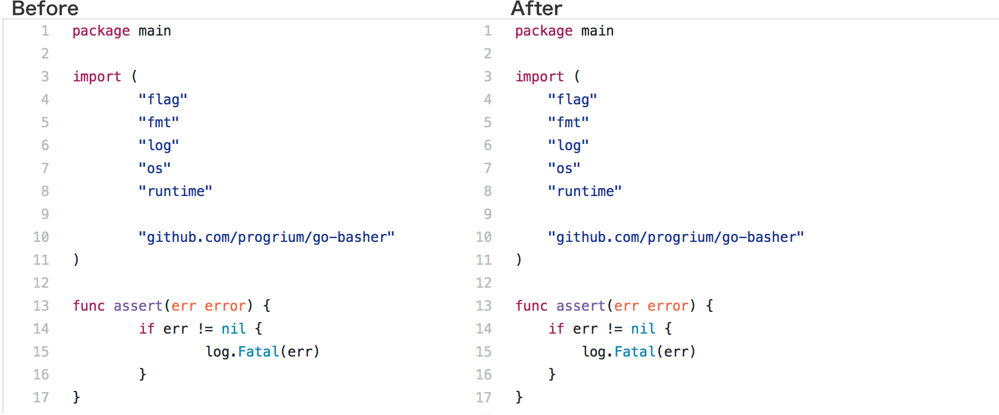

Tab Width on GitHub
---

> Safari extension - Make tab indented code more readable by forcing the tab size to 4 instead of 2

Inspired by [sindresorhus/tab-size-on-github](https://github.com/sindresorhus/tab-size-on-github) and pretty much same instead this one is for Apple Addicts.

## Install

~~Download the extension from releases page.~~

Doesn't work anymore on Safari 12+. Build and Archive with your own Xcode and AppleID to install.

> [Legacy Safari Extensions (.safariextz files) built with Safari Extension Builder and distributed through the Safari Extensions Gallery or your website, have been deprecated with Safari 12.](https://developer.apple.com/safari/extensions/)

## License

MIT

Feel free to redistribute, sell or whatever you want.🍎

